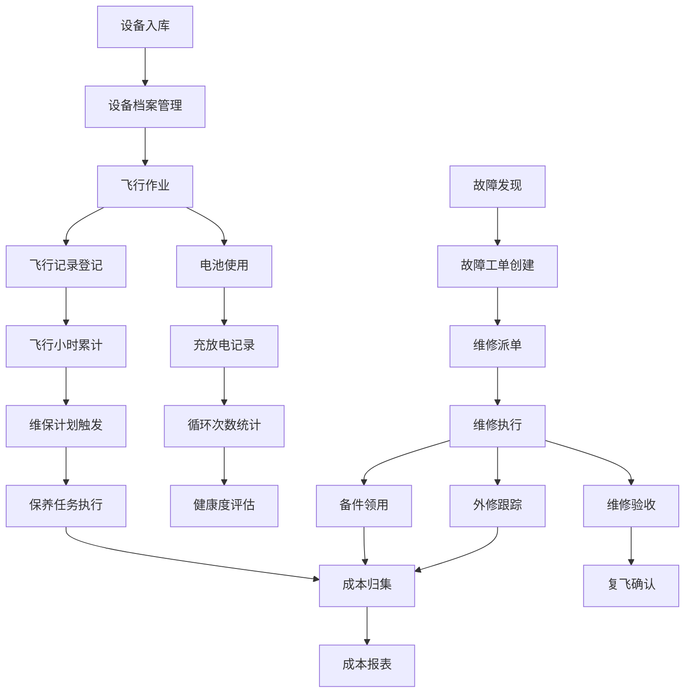

# 无人机机队资产与维保管理系统 PRD

## 1. 产品概述

无人机机队资产与维保 Web 应用，专为低空运营公司设计，用于全生命周期管理飞行器、电池、载荷设备及维修维保业务。系统实现资产数字化、维保流程化、成本透明化，提升机队运营效率和安全性。

## 2. 核心功能

### 2.1 用户角色

| 角色 | 注册方式 | 核心权限 |
|------|----------|----------|
| 系统管理员 | 后台创建 | 全部功能权限、用户管理、系统配置 |
| 运维主管 | 后台创建 | 资产审批、维保派单、报表查看、库存管理 |
| 飞手/维修员 | 后台创建 | 飞行记录登记、故障上报、备件领用、设备查询 |

### 2.2 功能模块

1. **资产总览**：仪表盘展示关键指标、设备状态统计、维保提醒、告警信息
2. **设备档案**：飞行器/电池/载荷入库建档、编号管理、责任人分配、资产卡片
3. **飞行记录**：飞行任务登记、飞行小时累计、起降次数统计、设备使用追踪
4. **电池寿命**：电池循环次数统计、充放电记录、健康状态评估、报废预警
5. **维保计划**：保养周期配置、到期提醒、保养任务生成与执行记录
6. **故障工单**：故障登记、维修派单、维修记录、外修跟踪、停飞/复飞管理
7. **备件库存**：备件入库、出库领用、库存盘点、低库存预警
8. **成本报表**：维保成本统计、折旧估算、成本分摊、资产盘点报表

### 2.3 页面详情

| 页面名称 | 模块名称 | 功能描述 |
|----------|----------|----------|
| 资产总览 | 统计卡片 | 在役设备数、总飞行小时、待处理工单、电池健康度 |
| 资产总览 | 状态分布 | 设备状态饼图、维保趋势折线图 |
| 资产总览 | 告警列表 | 维保到期、保险到期、电池报废、低库存预警 |
| 设备档案 | 设备列表 | 飞行器/电池/载荷分类筛选、搜索、状态标签 |
| 设备档案 | 设备详情 | 资产卡片、技术参数、责任人、使用历史、附件 |
| 设备档案 | 入库登记 | 设备信息录入、二维码编号生成、责任人分配 |
| 飞行记录 | 记录列表 | 飞行任务时间、飞行器、飞手、时长、起降次数 |
| 飞行记录 | 新增记录 | 飞行数据录入、设备使用关联、备注附件 |
| 电池寿命 | 电池列表 | 循环次数、健康度、状态、所属飞行器 |
| 电池寿命 | 充放电记录 | 充电记录、放电记录、容量衰减趋势 |
| 维保计划 | 计划配置 | 保养项目、周期设置、关联设备类型 |
| 维保计划 | 任务列表 | 待执行/已完成保养任务、执行记录 |
| 故障工单 | 工单列表 | 故障描述、状态、优先级、指派维修员 |
| 故障工单 | 工单详情 | 故障处理流程、维修记录、备件使用、外修跟踪 |
| 故障工单 | 停飞管理 | 设备锁定/解锁、复飞确认审批 |
| 备件库存 | 库存列表 | 备件分类、库存数量、单位、安全库存 |
| 备件库存 | 出入库 | 入库登记、出库领用、库存调整、盘点记录 |
| 成本报表 | 成本统计 | 维保成本、备件成本、外修成本按月/年统计 |
| 成本报表 | 折旧估算 | 资产折旧计算、残值估算 |
| 成本报表 | 资产盘点 | 盘点任务、盘盈盘亏、盘点报告 |

## 3. 核心流程

### 设备入库流程
设备采购到货 → 录入设备档案 → 生成编号标签 → 分配责任人 → 设备投入使用

### 维保执行流程
维保计划配置 → 系统自动生成保养任务 → 提醒通知 → 执行保养并记录 → 任务完成归档

### 故障处理流程
发现故障 → 上报故障工单 → 审核派单 → 维修执行（领用备件/外修）→ 维修验收 → 复飞确认

### 成本核算流程
各项成本数据采集 → 按月汇总统计 → 成本分摊到设备 → 生成成本报表

## 4. 用户界面设计

### 4.1 设计风格

- **主色调**：深蓝色（#1e3a5f）- 代表专业、科技、航空感
- **辅助色**：天蓝色（#3b82f6）- 交互元素、按钮
- **强调色**：橙色（#f97316）- 告警、提醒
- **成功色**：绿色（#10b981）- 正常状态、完成
- **危险色**：红色（#ef4444）- 故障、停飞
- **中性色**：深灰（#1f2937）、中灰（#6b7280）、浅灰（#f3f4f6）
- **字体**：Inter - 现代无衬线字体，清晰易读
- **按钮风格**：圆角 6px，微悬浮阴影，点击反馈
- **布局风格**：左侧导航栏 + 顶部状态栏 + 主内容区，卡片式布局
- **图标风格**：Lucide 线性图标，简洁现代

### 4.2 页面设计概述

| 页面名称 | 模块名称 | UI 元素 |
|----------|----------|---------|
| 资产总览 | 仪表盘 | 统计卡片网格、环形进度图、折线图、告警列表 |
| 设备档案 | 列表页 | 顶部筛选栏、表格列表、状态标签、操作按钮组 |
| 设备档案 | 详情页 | 两栏布局，左侧资产信息卡，右侧标签页（参数、历史、附件） |
| 飞行记录 | 列表页 | 日期筛选、数据表格、飞行时长条形图 |
| 电池寿命 | 监控页 | 电池卡片网格、健康度进度条、循环次数趋势图 |
| 维保计划 | 任务页 | 日历视图 + 列表视图切换，任务状态时间线 |
| 故障工单 | 工作台 | 看板视图（待处理/处理中/已完成），工单卡片拖拽 |
| 备件库存 | 库存页 | 分类侧边栏，库存表格，低库存红色高亮 |
| 成本报表 | 分析页 | 多维度图表（柱状图、饼图），数据透视表 |

### 4.3 响应式

- 桌面端优先（1440px+），适配 1024px 以上屏幕
- 平板端（768-1024px）：导航栏收起为图标模式
- 移动端（<768px）：底部标签栏导航，卡片堆叠布局
