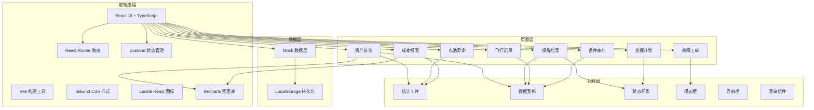
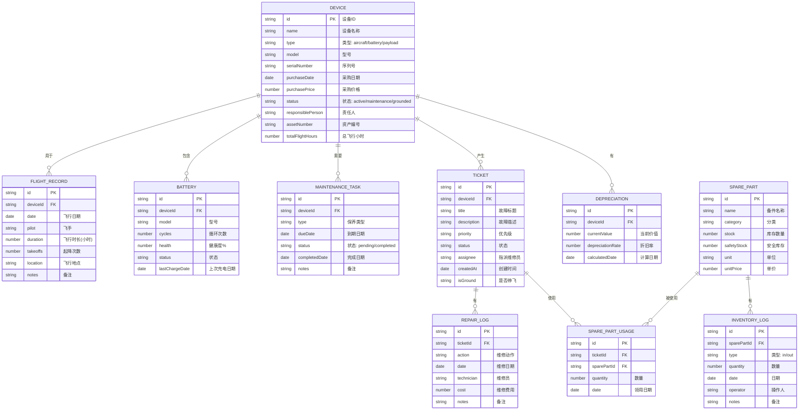

# 无人机机队资产与维保管理系统 - 技术架构文档

## 1. 架构设计



## 2. 技术栈说明

- **前端框架**：React 18 + TypeScript
- **构建工具**：Vite 5
- **样式方案**：Tailwind CSS 3
- **路由管理**：React Router DOM 6
- **状态管理**：Zustand 4
- **图标库**：Lucide React
- **图表库**：Recharts 2
- **数据持久化**：LocalStorage
- **包管理器**：npm

## 3. 路由定义

| 路由路径 | 页面名称 | 说明 |
|----------|----------|------|
| / | 资产总览 | 仪表盘首页 |
| /devices | 设备档案 | 设备列表和管理 |
| /devices/:id | 设备详情 | 单个设备详情页 |
| /flights | 飞行记录 | 飞行任务记录 |
| /batteries | 电池寿命 | 电池监控管理 |
| /maintenance | 维保计划 | 保养任务管理 |
| /tickets | 故障工单 | 工单处理工作台 |
| /inventory | 备件库存 | 库存管理 |
| /reports | 成本报表 | 成本分析报表 |

## 4. 数据模型

### 4.1 数据模型定义



### 4.2 初始数据

系统使用 Mock 数据，存储在 LocalStorage 中。

## 5. 项目结构

```
src/
├── components/          # 可复用组件
│   ├── layout/        # 布局组件
│   │   ├── Sidebar.tsx
│   │   ├── Header.tsx
│   │   └── Layout.tsx
│   ├── ui/           # UI 基础组件
│   │   ├── StatCard.tsx
│   │   ├── DataTable.tsx
│   │   ├── StatusBadge.tsx
│   │   ├── Modal.tsx
│   │   └── Button.tsx
│   └── charts/       # 图表组件
│       ├── LineChart.tsx
│       ├── PieChart.tsx
│       └── BarChart.tsx
├── pages/             # 页面组件
│   ├── Dashboard.tsx
│   ├── Devices.tsx
│   ├── DeviceDetail.tsx
│   ├── Flights.tsx
│   ├── Batteries.tsx
│   ├── Maintenance.tsx
│   ├── Tickets.tsx
│   ├── Inventory.tsx
│   └── Reports.tsx
├── store/             # 状态管理
│   └── useStore.ts
├── data/              # Mock 数据
│   └── mockData.ts
├── types/             # TypeScript 类型
│   └── index.ts
├── utils/             # 工具函数
│   └── helpers.ts
├── App.tsx
├── main.tsx
└── index.css
```

## 6. 核心功能实现要点

### 6.1 状态管理
使用 Zustand 管理全局状态，包含：
- 设备列表状态
- 工单状态
- 库存状态
- 用户偏好设置

### 6.2 数据持久化
使用 Zustand 的 persist 中间件，将核心数据持久化到 LocalStorage。

### 6.3 图表实现
使用 Recharts 实现：
- 设备状态分布饼图
- 维保趋势折线图
- 成本统计柱状图
- 电池健康度环形图
